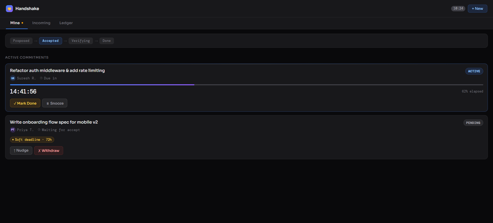

# 🤝 Handshake

> **A lightweight system for tracking real commitments between teammates.**

Not every task belongs in Jira.
But some promises shouldn’t be forgotten.

**Handshake** turns casual “I’ll do it” moments into clear, trackable commitments without adding process overhead.

---

## ✨ The Problem

Work doesn’t break because people are lazy.
It breaks because  **small commitments slip through** .

* “I’ll review that PR”
* “I’ll send the file”
* “I’ll check the logs”

These aren’t big enough for Jira.
But they’re important enough to block progress.

Current tools fail here:

* **Jira** → too heavy for micro-tasks
* **Slack/Teams** → messages get buried
* **Reminders** → one-sided, no shared visibility

Result:
Work stalls, follow-ups feel awkward, and accountability becomes unclear.

---

## 🚀 The Solution: Handshake Protocol

Handshake introduces a simple idea:

> **If it matters, both sides acknowledge it.**

A commitment only exists when it’s mutually accepted.

### Flow:

1. **Request**
   Capture a commitment directly from your workflow (chat, PR, task).
2. **Accept / Snooze**
   The other person acknowledges or defers it with context.
3. **Track**
   The system quietly keeps it visible without spamming.
4. **Done → Verify**
   Completion is confirmed, not assumed.

---

## 🧠 What Makes It Different

* **Built for micro-commitments**
  Not tasks. Not tickets. Just the small things that actually block work.
* **Two-sided accountability**
  No silent reminders. Both people are aware.
* **Zero awkward follow-ups**
  The system nudges, not you.
* **No process bloat**
  Faster than creating a Jira ticket. Cleaner than Slack pings.

---

## 🛠 Features

* **Minimal UI**
  Fast, distraction-free interface designed for daily use
* **Snooze with context**
  Delay without ignoring. Keeps communication healthy
* **Escalating nudges**
  Subtle reminders that increase only when needed
* **Undeclared timelines**
  Track “soon” tasks without forcing deadlines
* **Privacy-first design**
  No unnecessary exposure of internal workflows

---

## 🏗 Installation (MVP)

*Developer Preview*

1. Clone the repository
2. From the repo root, run `run_handshake.cmd`
   - this installs backend and frontend dependencies
   - starts the backend on `uvicorn main:app --reload`
   - starts the frontend with `npm run dev`
3. Open `http://localhost:5173` in your browser

> If you prefer manual startup, use the backend and frontend folders separately:
> - `cd handshake/backend && .venv\Scripts\activate.bat && pip install -r requirements.txt && uvicorn main:app --reload`
> - `cd handshake/frontend && npm install && npm run dev`

---

---

## 📊 Roadmap

* [X] Phase 1: Browser Extension MVP
* [ ] Phase 2: Slack / Teams integration
* [ ] Phase 3: Lightweight team insights (commitment visibility, not surveillance)
* [ ] Phase 4: Cross-tool “commitment layer” for teams

---

## 🤝 Contributing

If you care about improving **how teams actually coordinate work** without adding friction, open an issue or share your ideas.

---

### *“Not everything needs a ticket. But some things shouldn’t be forgotten.”*
