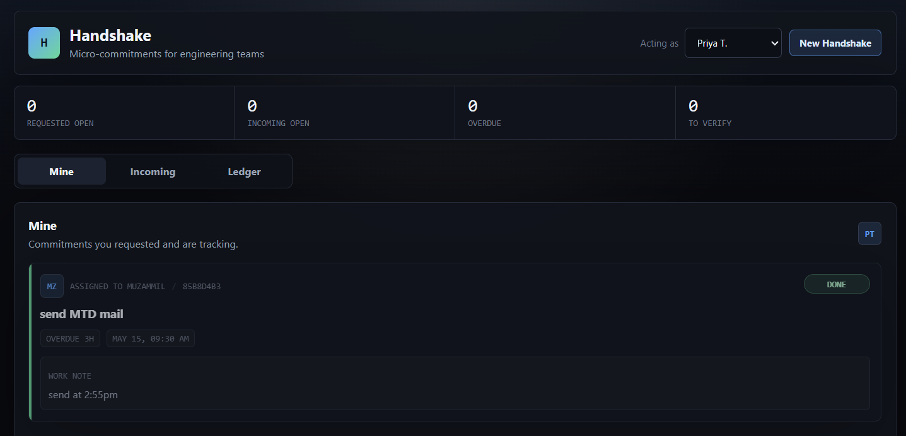

# 🤝 Handshake MVP

Micro-commitment tracker for small teams. Turns "I'll do it" into a tracked, two-sided accountability loop.

**Stack:** React + Vite · FastAPI · SQLite



---

## Prerequisites

* Python 3.10+
* Node 18+

---

## Run locally

### Terminal 1 — Backend

```bash
cd handshake/backend
pip install -r requirements.txt
uvicorn main:app --reload
```

API runs at `http://localhost:8000`

Interactive docs at `http://localhost:8000/docs`

The database seeds 4 demo commitments on first run so the UI isn't empty.

### Terminal 2 — Frontend

```bash
cd handshake/frontend
npm install
npm run dev
```

UI runs at `http://localhost:5173`

---

## How it works

Handshake tracks commitments between two people: a **requester** (who asks) and an **assignee** (who does the work).

The top-right dropdown switches your active identity — this simulates being a different teammate without a login system. Every API call sends `X-User-Id: <selected>` so each person sees their own view.

| Tab      | What you see                  |
| -------- | ----------------------------- |
| Mine     | Commitments you requested     |
| Incoming | Commitments assigned to you   |
| Ledger   | Everything you're involved in |

---

## State machine

```
pending → active → verifying → done
            ↕          ↕
         snoozed   (reject → back to active)
```

| Transition              | Who can trigger                      |
| ----------------------- | ------------------------------------ |
| `pending → active`   | Assignee (accept)                    |
| `active → verifying` | Assignee (mark done + optional note) |
| `verifying → done`   | Requester (verify)                   |
| `verifying → active` | Requester (request revision)         |
| `any → snoozed`      | Either party (requires a reason)     |
| `snoozed → active`   | Either party (resume)                |

---

## API

All endpoints require the `X-User-Id` header (sent automatically by the frontend).

```
GET   /users
GET   /commitments/mine
GET   /commitments/incoming
GET   /commitments/ledger
POST  /commitments
PATCH /commitments/{id}
```

---

## File structure

```
handshake/
├── backend/
│   ├── main.py           # FastAPI routes + CORS + transition validation
│   ├── models.py         # SQLAlchemy ORM + CommitmentState enum
│   ├── schemas.py        # Pydantic request/response schemas
│   ├── database.py       # SQLite engine + session
│   └── requirements.txt
└── frontend/
    ├── src/
    │   ├── App.jsx                    # Root: tabs, user switcher, data fetching
    │   ├── api.js                     # All axios calls + X-User-Id injection
    │   ├── index.css
    │   └── components/
    │       ├── CommitmentCard.jsx     # State-aware action buttons per role
    │       ├── NewHandshakeModal.jsx
    │       └── Ledger.jsx
    ├── index.html
    ├── vite.config.js                 # Proxies /api → localhost:8000
    └── package.json
```
